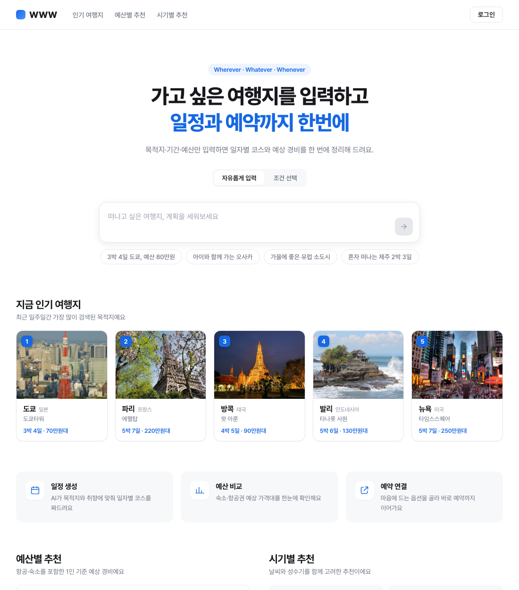
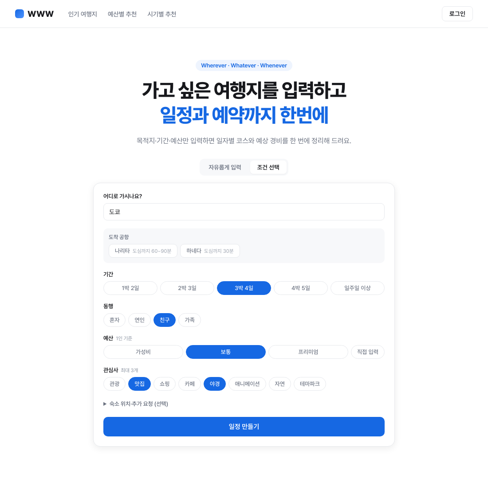
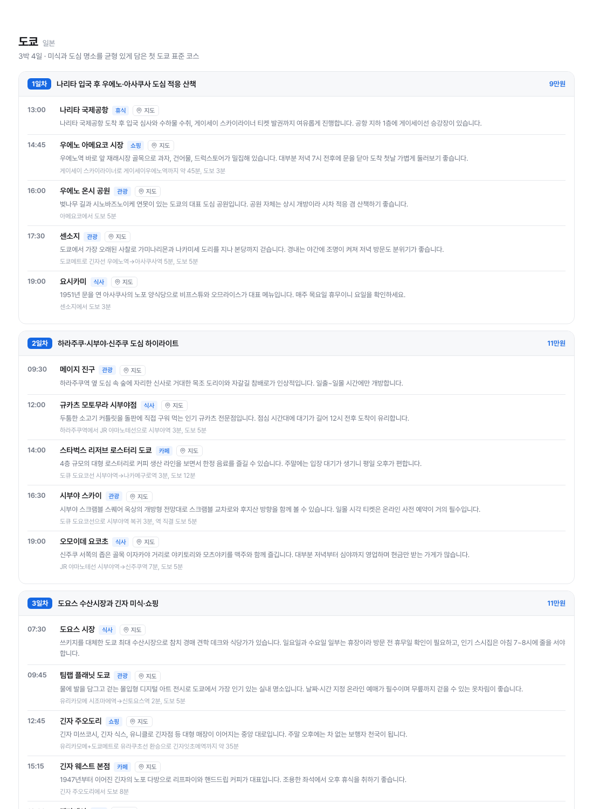
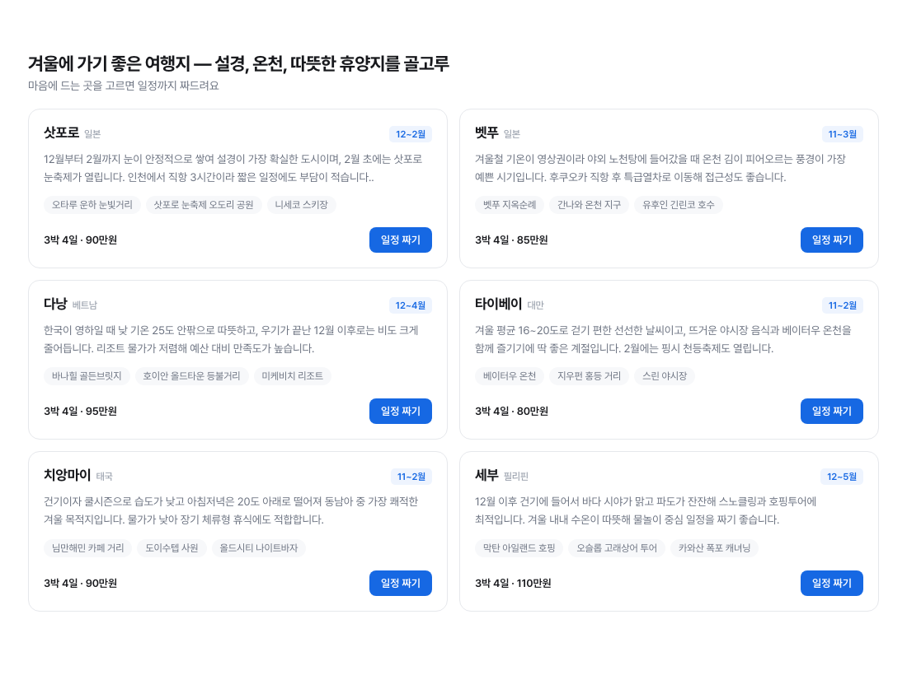

# WWW — AI 여행 일정 플래너

목적지와 조건을 입력하면 **실제로 이동 가능한 동선 중심의 일자별 여행 일정**을 만들어 주는 서비스입니다.

LLM을 그대로 붙이면 일정 1건에 **약 128원, 140초**가 듭니다. 이 프로젝트는 그 비용과 지연을
어떻게 실측하고 줄여 나가는지에 초점을 두고 만들고 있습니다.



---

## 목차

- [무엇을 만드는가](#무엇을-만드는가)
- [화면](#화면)
- [비용·지연 설계](#비용지연-설계)
- [설계 판단 기록](#설계-판단-기록)
- [아키텍처](#아키텍처)
- [기술 스택](#기술-스택)
- [실행 방법](#실행-방법)
- [현재 상태와 다음 단계](#현재-상태와-다음-단계)
- [출처 및 라이선스](#출처-및-라이선스)

---

## 무엇을 만드는가

일정 생성 서비스는 많지만, 대부분 "가볼 만한 곳 목록"에 가깝습니다. WWW는 **동선**을
1순위로 둡니다.

- 하루 일정을 지리적으로 가까운 곳끼리 묶습니다
- 장소 간 이동 수단과 소요시간을 구체적으로 적습니다 — *"도부 스카이트리라인 아사쿠사역에서 한 정거장, 약 5분"*
- 운영시간과 휴무일을 반영합니다 — *"화요일 정기 휴무이니 요일을 확인하세요"*
- 도착 공항에 따라 첫날 동선을 바꿉니다 (나리타 ↔ 하네다는 도심까지 60분 차이)
- 마지막 날은 공항 이동 시간을 확보하고 공항 도착으로 끝냅니다

입력 방식은 두 가지입니다.

| 모드 | 입력 | 결과 |
|---|---|---|
| 자유 입력 | `"도쿄 3박4일 여행"` | 일자별 일정 |
| 자유 입력 | `"겨울 여행지 추천해줘"` | 목적지 추천 6곳 |
| 조건 선택 | 목적지·기간·동행·예산·관심사 | 일자별 일정 |

목적지를 정하지 않은 요청은 일정이 아니라 **목적지 추천**으로 답합니다. 추천 카드를 누르면
그 도시의 일정 생성으로 이어집니다.

---

## 화면

### 조건 선택 — 도시 자동완성과 도착 공항



도시는 한글·영문·**초성**으로 찾습니다 (`ㄷㅋ` → 도쿄). 공항이 둘 이상인 도시는 도심까지의
소요시간과 함께 선택지가 나타납니다.

### 생성된 일정



각 장소에 구글 지도 링크가 붙습니다. 동명의 다른 장소로 잡히지 않도록 도시명을 함께 넘깁니다.

### 목적지 추천



설경·온천·따뜻한 휴양처럼 성격이 겹치지 않게 고르고, 시기 근거와 예상 경비를 함께 제시합니다.

---

## 비용·지연 설계

이 프로젝트의 중심 주제입니다. **모든 수치는 직접 측정한 값입니다.**

### 문제 정의

일정 1건을 생성하는 데 드는 비용을 먼저 쟀습니다.

```
입력 22토큰 + 캐시읽기 2,895토큰 + 출력 3,466토큰  →  약 128원 / 140초
```

**비용의 98%가 출력 토큰**이었습니다. 즉 입력을 줄이는 최적화는 의미가 없고,
**생성 자체를 하지 않는 것**만이 실질적인 절감입니다.

### 대응 1 — 의미 기반 캐시 키

프롬프트 원문을 해시하면 히트율이 사실상 0입니다. 같은 뜻의 문장이 전부 다른 키가 되기 때문입니다.

그래서 요청을 먼저 **정규화된 파라미터로 환원**한 뒤 키를 만듭니다.

```
"도쿄 3박4일 여행"          ┐
"도쿄로 3박4일 다녀오려고 해"  ├→  도쿄|미지정|3|미지정|미지정|미지정|가을
"도쿄 여행 3박 4일 추천해줘"   ┘
```

키 설계에서 신경 쓴 부분:

- **예산은 50만원 구간으로 뭉갭니다.** 80만원과 85만원에 다른 일정을 만들 이유가 없습니다
- **계절을 넣었습니다.** 봄 교토와 겨울 교토는 같은 일정이면 안 됩니다
- **관심사는 정렬해 전부 넣되 UI에서 3개로 제한합니다.** 일부만 키에 넣으면
  "맛집+쇼핑"으로 만든 일정을 "맛집"만 고른 사람에게 주게 됩니다
- **숙소 위치·자유 텍스트는 키에서 뺐습니다.** 고유값이 너무 많아 키에 넣으면 캐시가
  무의미해집니다. 대신 값이 있으면 **캐시를 우회**시켜 요청과 다른 결과를 돌려주지 않게 합니다

> 축을 하나 더하면 결과는 정확해지지만 조합이 곱으로 늘어 히트율이 떨어집니다.
> HIT는 0원이고 MISS는 128원이므로, **캐시 키 설계는 곧 비용 설계**입니다.

### 대응 2 — 구조화 입력으로 LLM 호출 제거

자유 문장을 파라미터로 바꾸려면 LLM(Haiku)을 한 번 호출해야 하고, 이 비용은 **캐시 히트여도
항상 발생**합니다. 조건을 직접 고르게 하면 이 호출 자체가 사라집니다.

| 경로 | 응답 시간 | LLM 호출 | 비용 |
|---|---|---|---|
| 자유 입력 · 캐시 MISS | 140초 | 추출 + 생성 | 약 128원 |
| 자유 입력 · 캐시 HIT | 1.5~6초 | 추출만 | 약 1.9원 |
| **조건 선택 · 캐시 HIT** | **0.20초** | **없음** | **0원** |

### 대응 3 — 사전 생성 시드

인기 조합의 일정을 미리 만들어 JSON으로 저장하고, 기동 시 캐시 테이블에 주입합니다.
**새 배포나 DB 초기화 후에도 첫 사용자가 즉시 응답을 받습니다.**

```
서버 시작 → seed/itineraries.json 읽기 → 없는 키만 INSERT
```

기동 시 LLM을 호출하지 않습니다. 비용은 시드를 만들 때 한 번만 발생합니다.
이미 있는 키는 건드리지 않아 운영 중 쌓인 적중 횟수와 최신 일정이 시드 버전으로 되돌아가지
않습니다.

### 대응 4 — 프롬프트 캐싱과 effort 튜닝

고정 시스템 프롬프트에 `cache_control`을 걸어 반복 요청의 입력 비용을 줄입니다
(실측 캐시 읽기 2,895토큰).

`effort`를 바꿔 품질과 비용을 비교했습니다.

| effort | 응답 시간 | 출력 토큰 | 비용 | 장소 수 | 이동 설명 |
|---|---|---|---|---|---|
| low | 124초 | 2,258 | 82원 | 18 | *"버스와 도보로 약 20분"* |
| medium | 134초 | 2,924 | 107원 | 20 | 중간 |
| high | 141초 | 3,466 | 128원 | 23 | *"JR 주오·소부선, 아사쿠사바시 환승 약 35분"* |

**effort는 비용 레버지 속도 레버가 아니라는 결론**을 얻었습니다. 최저로 낮춰도 12%밖에
빨라지지 않습니다. 병목이 추론 깊이가 아니라 출력 토큰 생성 자체이기 때문입니다.
지연을 없애려면 캐싱이나 스트리밍이어야 합니다.

---

## 설계 판단 기록

되돌리기 어려운 결정일수록 근거를 남겨 둡니다. 나중에 전제가 바뀌었을 때
무엇을 다시 판단해야 하는지 알 수 있어야 하기 때문입니다.

### 장소 DB(RAG)를 지금 도입하지 않은 이유

"관광지·맛집 DB를 만들고 LLM은 조합만 하게 하자"는 구조를 검토했습니다.
비용 관점에서 실제로 토큰을 재봤습니다.

| | 입력 토큰 |
|---|---|
| 현재 방식 | 495 |
| 장소 100곳 주입 | **21,197** |

건당 약 +$0.10이 늘어 **비용이 오히려 두 배**가 됩니다. RAG의 진짜 가치는 비용이 아니라
**정확성**(폐업·존재하지 않는 장소 방지)이며, 비용을 줄이려면 DB 도입과 함께
**출력을 장소 ID로 바꿔** 서버가 설명을 채우는 구조여야 합니다.

현재 트래픽에서는 인프라 비용(RDS·Redis·Fargate)이 LLM 비용을 크게 넘어서므로,
**실사용 데이터를 본 뒤 도입**하기로 했습니다. 캐시 MISS 로그에 키가 그대로 남으므로
무엇을 먼저 채워야 할지는 추측이 아니라 관측으로 정할 수 있습니다.

### 기동 시 API 키 검사

SDK는 자격증명을 첫 요청 시점에 해석합니다. 키가 없어도 서버는 정상적으로 뜨고,
사용자가 버튼을 누를 때마다 401 → 502만 반복되는 상태가 됩니다. 재시도로는 절대
해결되지 않는데 "다시 시도해 주세요"만 나오는, 가장 나쁜 실패 방식입니다.

빈 생성 시점에 검사해 **기동을 중단**하고, `FailureAnalyzer`로 스택 트레이스 대신
해결 방법을 출력하도록 했습니다.

```
APPLICATION FAILED TO START

Description:
ANTHROPIC_API_KEY 환경변수가 설정되지 않았습니다. 키가 없으면 일정 생성
요청이 전부 401로 실패하므로 기동을 중단했습니다.

Action:
  export ANTHROPIC_API_KEY=sk-ant-...
  ./gradlew bootRun -PskipFrontend
```

오류도 구분해 처리합니다. 401(설정 오류)은 재시도로 낫지 않으므로 502가 아닌 500으로
분리하고, 400(크레딧 소진)은 운영 중 가장 흔한 중단 사유라 원문을 로그에 남깁니다.

### 도착 공항을 캐시 키에 넣은 이유

같은 도쿄 3박 4일이라도 어느 공항으로 들어가느냐에 따라 결과가 실제로 달라집니다.

```
공항 미지정 → 11:00 하네다 → 신주쿠   (게이큐선 45분)
나리타 지정 → 13:00 나리타 → 우에노   (스카이라이너 45분), 귀국편 85분 확보
```

스카이라이너 종점에 맞춰 **첫날 권역 자체가 바뀝니다.** 결과가 달라지는 축이므로
키에 넣었고, 공항이 하나뿐인 도시는 항상 `미지정`이라 조합이 늘지 않습니다.

---

## 아키텍처

```
                   ┌─────────────────────────────┐
   브라우저  ────→  │  Spring Boot (단일 서버)      │
                   │  · React 정적 리소스 서빙      │
                   │  · API 키 서버 보관            │
                   └──────────────┬──────────────┘
                                  │
                    ┌─────────────┴─────────────┐
                    │  요청 정규화                │
                    │  조건 선택 → 규칙 기반       │
                    │  자유 입력 → Haiku 추출      │
                    └─────────────┬─────────────┘
                                  │
                        ┌─────────┴─────────┐
                        │   캐시 키 조회      │
                        └────┬─────────┬────┘
                      HIT    │         │    MISS
                   0.2~6초   │         │    140초
                             ▼         ▼
                        즉시 응답   Claude 생성 → 저장
```

프론트엔드를 Vercel에, 백엔드를 별도 서버에 두는 구성도 검토했으나 **단일 서버**를
선택했습니다. 트래픽이 없는 단계에서 CDN 이점은 없는 반면 CORS와 HTTPS 이중 설정이라는
순수 설정 비용이 발생하기 때문입니다. 프론트 빌드 결과가 jar 안에 포함되어 배포 대상이
하나입니다.

### 주요 구성

```
backend/src/main/java/com/www/
  config/     AnthropicConfig, MissingApiKeyFailureAnalyzer, SpaForwardingConfig
  city/       도시 검색 (초성 인덱스), 공항 정보
  plan/       PlanController, PlanService, PromptExtractor, ApiExceptionHandler
    cache/    CacheKey, ItineraryCacheEntity
    dto/      Itinerary, Suggestions, PlanRequest, PlanParams
    seed/     SeedLoader(기동 주입), SeedGenerator(사전 생성)
src/          React 랜딩 · 결과 화면
```

### API

| 메서드 | 경로 | 설명 |
|---|---|---|
| `POST` | `/api/plan` | 일정 생성 또는 목적지 추천. 응답 `type`으로 구분 |
| `GET` | `/api/cities?q=` | 도시 자동완성 (한글·영문·초성) |

응답 헤더 `X-WWW-Cache: HIT \| MISS`로 캐시 적중 여부를 확인할 수 있습니다.

---

## 기술 스택

| 영역 | 사용 기술 |
|---|---|
| Backend | Java 21, Spring Boot 4.1, Spring Data JPA |
| AI | Claude API (Opus 5 / Haiku 4.5), 구조화 출력, 프롬프트 캐싱 |
| DB | H2 (파일 모드) — 운영 시 환경변수로 교체 |
| Frontend | React 18, Vite 5 |
| Build | Gradle (프론트 빌드를 jar에 포함) |

**구조화 출력**을 사용해 응답 스키마를 Java `record`에서 자동 도출합니다. 별도 파싱이나
검증 코드 없이 타입 그대로 받으므로, 산문이 섞여 들어올 여지가 없습니다.

```java
StructuredMessageCreateParams<Itinerary> params = MessageCreateParams.builder()
        .model(model)
        .systemOfTextBlockParams(List.of(
                TextBlockParam.builder()
                        .text(SYSTEM_PROMPT)
                        .cacheControl(CacheControlEphemeral.builder().build())
                        .build()))
        .outputConfig(StructuredOutputConfig.<Itinerary>builder()
                .format(Itinerary.class)
                .effort(OutputConfig.Effort.of(effort))
                .build())
        .addUserMessage(userPrompt)
        .build();
```

---

## 실행 방법

### 사전 준비

[Claude Console](https://platform.claude.com/settings/keys)에서 발급한 API 키가 필요합니다.
키는 서버 환경변수로만 전달하며 저장소에 넣지 않습니다.

```bash
export ANTHROPIC_API_KEY=sk-ant-...
```

`JAVA_HOME`은 설정할 필요가 없습니다. Gradle 툴체인이 JDK 21을 찾습니다.

### 개발 모드 (프론트 수정이 즉시 반영됨)

```bash
# 터미널 1 — 백엔드. -PskipFrontend 로 npm 빌드를 건너뛴다
cd backend && ./gradlew bootRun -PskipFrontend --console=plain

# 터미널 2 — Vite. /api 요청만 8080으로 프록시된다
npm install && npm run dev     # http://localhost:5173
```

> `bootRun`은 서버가 떠 있는 동안 `80% EXECUTING`에 머무릅니다. 멈춘 것이 아니라 정상입니다.

### 운영 빌드 (프론트가 jar에 포함, 서버 하나)

```bash
cd backend && ./gradlew bootJar
java -jar build/libs/backend-0.0.1-SNAPSHOT.jar     # http://localhost:8080
```

### 옵션

```bash
# 추론 강도 변경 (low / medium / high / xhigh / max, 기본 high)
WWW_EFFORT=medium java -jar build/libs/backend-0.0.1-SNAPSHOT.jar

# 인기 조합 일정 사전 생성 → seed/itineraries.json 갱신
#   유료 호출이 조합 수만큼 발생하므로 --www.seed.limit 으로 먼저 소량 확인할 것
./gradlew bootRun -PskipFrontend \
  --args='--spring.profiles.active=seed --www.seed.concurrency=4'
```

토큰 사용량은 백엔드 로그에 남습니다.

```
일정 생성 완료 (effort=high) - 입력 22 / 캐시쓰기 0 / 캐시읽기 2895 / 출력 3466 토큰
캐시 HIT [도쿄|미지정|3|미지정|미지정|미지정|가을] - 누적 3회
```

---

## 현재 상태와 다음 단계

### 구현 완료

- 일정 생성 (구조화 출력, 프롬프트 캐싱, effort 설정)
- 목적지 추천 및 일정 연계
- 의미 기반 캐시 계층 + 기동 시 시드 주입
- 도시 검색 164곳 / 60개국, 초성 인덱스, 공항 13곳
- 자유 입력 · 조건 선택 두 가지 입력 경로
- 기동 시 설정 검증, 오류 유형별 분리 처리

### 진행 예정

- **시드 확충** — 현재 10건. 인기 조합 60건까지 채우고, 계절 전환 시 갱신
- **스트리밍** — 캐시 MISS의 140초를 견딜 만하게. 운영 배포 시 프록시 타임아웃 회피
- **장소 DB + ID 기반 출력** — 정확성 확보와 출력 토큰 절감. 트래픽 확인 후 도입
- **어필리에이트 딥링크 연결**, 무료 이용 횟수 게이트

### 알려진 한계

- 장소 정보는 모델 지식 기반이라 폐업·이전 가능성이 있습니다. 인기 목적지는 시드에서
  나가므로, 시드 검수로 트래픽 대부분의 정확성을 확보하는 것이 현재 단계의 대책입니다
- 예상 경비는 실시간 요금이 아닌 참고용 추정치이며, UI에 이를 명시합니다
- H2 파일 모드는 개발용입니다. 강제 종료 시 잔여 잠금이 남을 수 있으며
  `backend/data/` 삭제로 해결됩니다 (캐시이므로 시드로 복구됩니다)

---

## 출처 및 라이선스

- 여행지 사진: Wikimedia Commons (Public Domain / CC BY-SA) — 저작자 표시는
  [CREDITS.md](CREDITS.md)와 서비스 푸터에 함께 표기합니다
- 서체: [Pretendard](https://github.com/orioncactus/pretendard) (SIL Open Font License 1.1)
